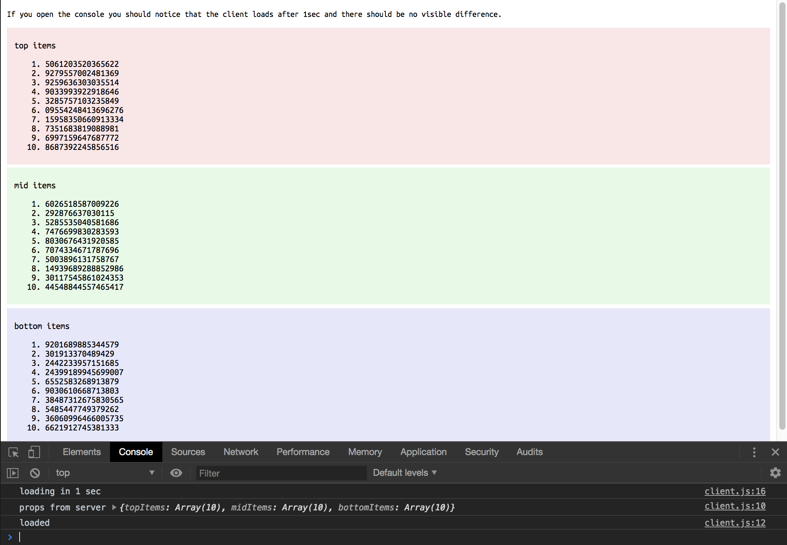

# svelte-hydrate-test

1. Render the Svelte app on the server (SSR)
2. Send the client some initial state
3. Load the initial state on the client
4. Render the Svelte app on the client

If it works there should be no visible difference between
what the server renders and what the client renders. Svelte should hydrate the existing DOM structure and not change or replace it. Rendering is delayed one second on the client so we can observe the change, if any.

---

## Testing

You can try yourself quickly and easily.

```sh
git clone https://github.com/tcrowe/svelte-hydrate-test.git
cd svelte-hydrate-test
npm install
npm run dev
open http://127.0.0.1:12998
```

You can check [./package.json](./package.json) for what that `dev` task is doing. It builds with [webpack](https://webpack.js.org/) and [svelte-loader](https://github.com/sveltejs/svelte-loader). The server will bind to `http://127.0.0.1:12998` by default.

## Copying, license, and contributing

Copyright (C) Tony Crowe <github@tonycrowe.com> (https://tcrowe.github.io) 2019

⚖️ svelte-hydrate-test is Free Software protected by the GPL 3.0 license. See [./COPYING](./COPYING) for more information. (free as in freedom)

---


